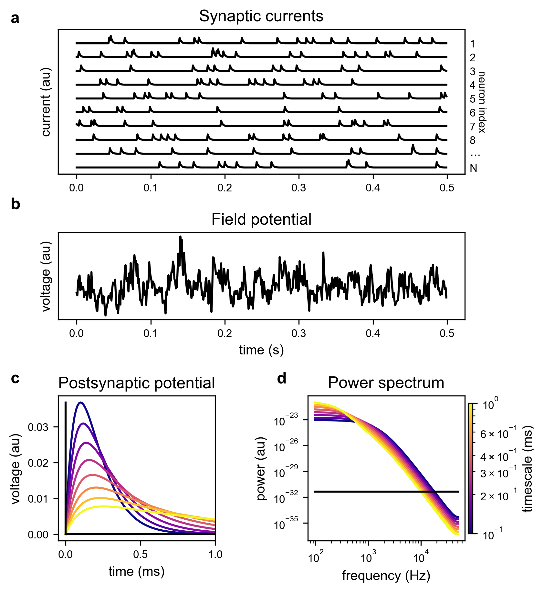
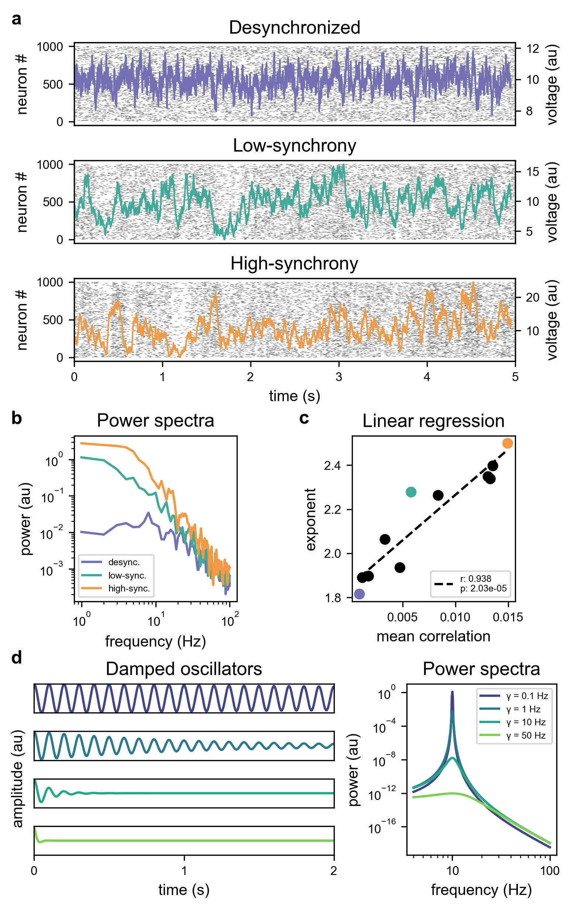
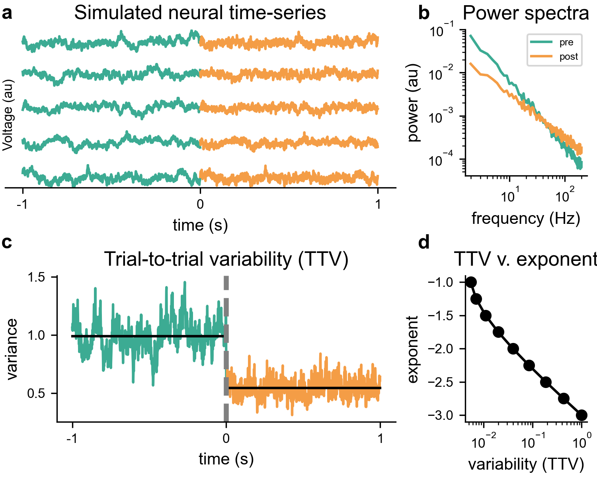

# Aperiodic neural activity: mechanisms and functional significance

## Authors:
Michael Preston Jr.<sup>1</sup>, Sydney Smith<sup>2</sup>, Bradley Voytek<sup>1,3-5</sup>

1. Neurosciences Graduate Program, University of California, San Diego, La Jolla, CA, USA 92093.  
2. Department of Psychology, Yale University, New Haven, CT, USA 06510.  
3. Department of Cognitive Science,  
4. Halıcıoğlu Data Science Institute,  
5. Kavli Institute for Brain and Mind, University of California, San Diego, La Jolla, CA, USA 92093.

## Citation:
Preston, M., Smith, S., & Voytek, B. (2024). Aperiodic neural activity: mechanisms and functional significance. *TBD*

## Overview:
Recent methodological developments have spurred interest in aperiodic neural activity and its potential role in cognition and disease. In this review, we examine the putative physiological basis of aperiodic activity, its relationship to other measures of neural activity, and evidence for its functional and clinical significance. Computational modeling and empirical evidence show that aperiodic activity has many neural origins, primarily postsynaptic transmembrane currents across populations of neurons. While several other signal statistics capture features similar to aperiodic measures, this work has allowed researchers to more directly link aperiodic activity to underlying physiological processes. We discuss the implications of these findings for our understanding of cognition and disease, and highlight open questions for future research.

## Figures:

*Figure 1. Basic model of aperiodic activity.*  


*Figure 2. Additional mechanisms underlying aperiodic activity.*  


*Figure 3. Integrating previous findings under the umbrella of aperiodic dynamics.*

## Project Guide:
To reproduce the figures presented in this review, please follow the steps below:
1. Clone this repository to your local machine using:
    ```bash
   git clone https://github.com/voytekresearch/review_functional_aperiodic.git
    ```
2. Navigate to the project directory:
    ```bash
    cd review_functional_aperiodic
     ```
3. Create a virtual environment (optional but recommended):
    ```bash
    python -m venv venv
    source venv/bin/activate  # On Windows use `venv\Scripts\activate`
    ```
4. Install the required packages using pip:
    ```bash
    pip install -r requirements.txt
    ```
5. Run the Makefile to generate all figures:
    ```bash
    make all
    ```

## Requirements:
To ensure compatibility, please use the following package versions. All packages can be installed via pip as described in the Project Guide.

numpy == 1.26.4  
scipy == 1.16.0  
pandas == 2.3.1  
matplotlib == 3.10.3  
seaborn == 0.13.2  
neurodsp == 2.3.0  
specparam == 2.0.0rc3  
quantities == 0.16.2  
neo == 0.14.2  
elephant == 1.1.1  

## License:
This work is licensed under a GNU General Public License v3.0. See LICENSE for details.
  